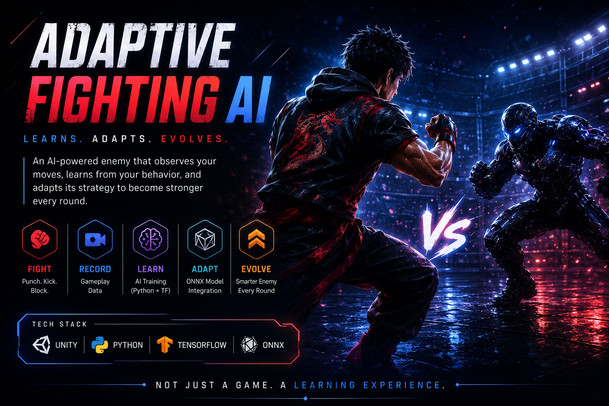

# Adaptive Fighting AI



An AI-powered adaptive fighting game prototype built with **Unity, C#, Python, TensorFlow, and ONNX**, inspired by the adaptive opponent concept from *Ra.One*.

---

## Overview

Adaptive Fighting AI explores a simple but ambitious idea:

> **What if a game enemy could observe the player, learn from their combat behavior, and continuously adapt its fighting strategy instead of relying on fixed scripted logic?**

Unlike traditional game AI that follows predefined behavior trees or hardcoded attack patterns, this project introduces a machine-learning-driven combat opponent capable of evolving over repeated gameplay sessions.

The enemy:

- Observes player actions
- Records gameplay telemetry
- Retrains its AI model
- Reloads its updated decision model in Unity
- Returns with adapted combat behavior

---

## Demo Architecture

```text
Fight
   ↓
Record Gameplay Data
   ↓
Train AI Model (TensorFlow)
   ↓
Export Updated ONNX Model
   ↓
Reload AI Brain in Unity
   ↓
Fight a Smarter Enemy
```

---

## Features

### Adaptive AI System
- Self-learning enemy combat AI
- Continuous adaptation based on player behavior
- Real-time gameplay telemetry recording
- Automatic AI retraining pipeline
- ONNX model hot-reloading inside Unity
- Combat behavior evolution across rounds

### Combat System
- Third-person fighting gameplay
- Punch attacks
- Kick attacks
- Blocking mechanics
- Health management system
- Hit reactions
- Death animations
- Round reset management
- Combat UI integration

### Machine Learning Pipeline
- Gameplay data collection
- Feature engineering from combat state
- TensorFlow neural network training
- ONNX export for deployment
- Runtime inference inside Unity

---

## Technology Stack

### Game Development
- Unity
- C#
- Unity Inference Engine

### AI / Machine Learning
- Python
- TensorFlow
- NumPy
- tf2onnx
- ONNX

---

## System Architecture

```text
Unity Gameplay Layer
│
├── Player Controller
├── Adaptive Enemy AI
├── Combat System
├── Match Manager
├── Gameplay Recorder
│
Python ML Training Layer
│
├── Gameplay Data Processing
├── Feature Extraction
├── Neural Network Training
├── ONNX Model Export
│
Adaptive Runtime Layer
│
├── Model Loading
├── Real-Time Inference
├── Decision Execution
└── Continuous Adaptation
```

---

## AI Learning Inputs

The adaptive model currently learns from:

- Player position
- Enemy position
- Distance between fighters
- Player velocity
- Enemy velocity
- Player health
- Enemy health
- Player blocking state
- Enemy blocking state
- Combat action behavior

These parameters allow the enemy to make context-aware combat decisions rather than relying on static scripted logic.

---

## Installation & Setup

### Prerequisites

Install:

- Unity
- Python 3.x
- TensorFlow
- tf2onnx

Install Python dependencies:

```bash
pip install tensorflow tf2onnx numpy
```

---

### Clone Repository

```bash
git clone https://github.com/MohdWaheed21/AdaptiveFightingAI.git
cd AdaptiveFightingAI
```

---

### Configuration

Update the following files with your local paths:

#### MatchManager.cs

Configure:

- Python executable path
- Training script path
- Training working directory

Example:

```csharp
pythonExe = @"YOUR_PYTHON_PATH";
trainerPath = @"YOUR_TRAIN_SCRIPT_PATH";
trainerWorkingDir = @"YOUR_TRAINING_FOLDER";
```

---

#### train.py

Set ONNX export path:

```python
ONNX_PATH = r"YOUR_UNITY_PROJECT_PATH\Assets\AI\enemy_ai.onnx"
```

---

## Current Adaptive Workflow

1. Start a combat round in Unity
2. Player fights enemy
3. Gameplay recorder captures combat telemetry
4. Match ends
5. Python training pipeline executes
6. TensorFlow retrains model
7. Updated ONNX model exports directly into Unity
8. Unity reloads enemy AI model
9. Next round begins with adapted behavior

---

## Future Enhancements

Planned improvements:

- Advanced combo systems
- Counter attacks
- Dodge mechanics
- Smarter adaptation weighting
- Confidence-based decision systems
- Boss evolution mode
- Multiple enemy personalities
- Better environments and visuals
- Performance optimization
- Richer AI combat strategies

---

## Inspiration

Inspired by the adaptive AI combat concept from:

**Ra.One**

This project aims to transform that sci-fi concept into a practical interactive prototype.

---

## Collaboration

Developed in collaboration with:

**Vigneshwar Kuru**

---

## Project Status

**Core Concept Prototype Completed**

Currently under active development.

---

## Author

**Mohammed Waheed**

GitHub:  
https://github.com/MohdWaheed21

---

## License

This project is intended for educational, research, and experimental purposes.